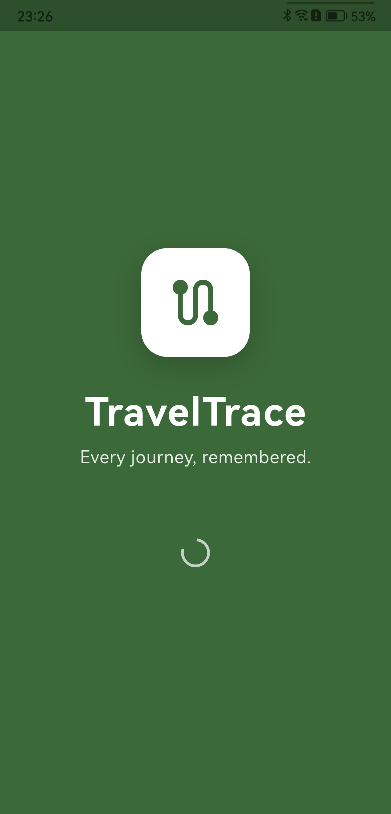
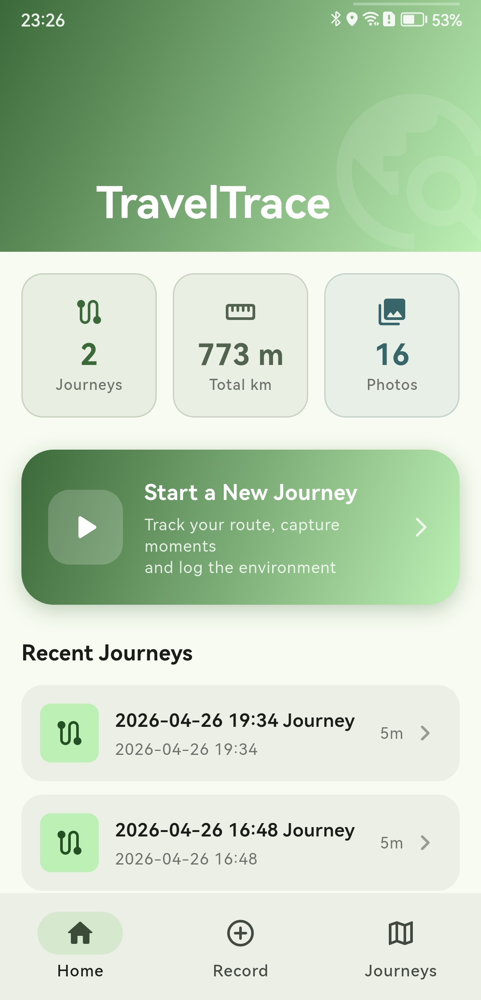
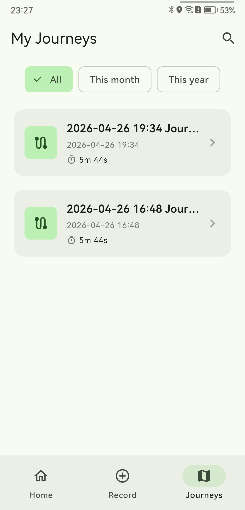
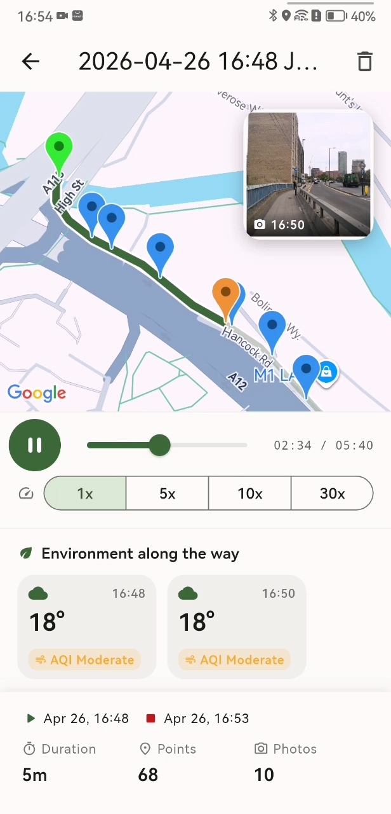
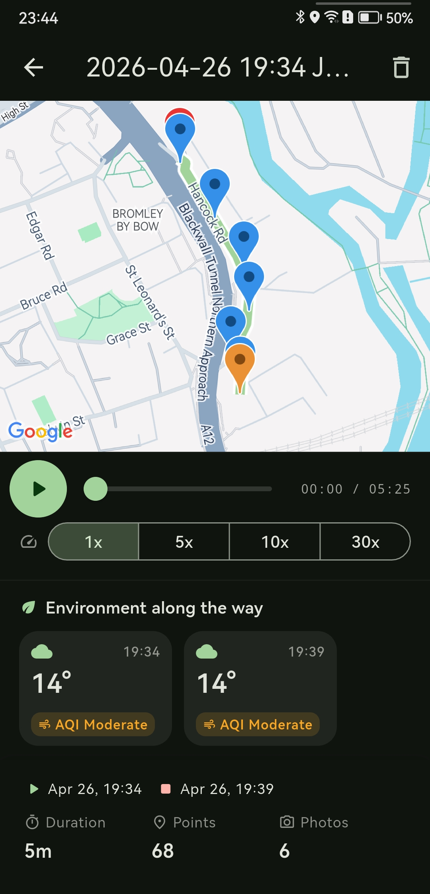

<div align="center">

# TravelTrace

**Every journey, remembered.**

A Flutter app that records GPS routes, pins photos along the way, and logs the surrounding environment — so a trip becomes more than a thumbnail.

[](https://flutter.dev)
[](https://dart.dev)
[](#)
[](#license)

UCL CASA0015 — Mobile Systems & Interactions — Individual Coursework 2025/26

</div>

---

## Contents

1. [Problem](#problem)
2. [Connected Environments theme](#connected-environments-theme)
3. [User persona](#user-persona)
4. [Demo & screenshots](#demo--screenshots)
5. [Landing page](#landing-page)
6. [Download](#download)
7. [Features](#features)
8. [Sensors](#sensors)
9. [External services & APIs](#external-services--apis)
10. [Widget showcase](#widget-showcase)
11. [Architecture](#architecture)
12. [Project structure](#project-structure)
13. [Getting started](#getting-started)
14. [Permissions](#permissions)
15. [User testing & iteration](#user-testing--iteration)
16. [Known limitations](#known-limitations)
17. [Author](#author)
18. [License](#license)

---

## Problem

Most travel apps fall into one of two camps:

- **Location loggers** (Google Timeline, Strava) record the *where* but strip out the *moments*.
- **Photo apps** (Instagram, Google Photos) capture the moments but lose the *journey* — looking back, you have a grid of disconnected images and no sense of how they were threaded together.

When you revisit a trip from three months ago, you remember neither route nor weather. You have a few photos and a fuzzy feeling.

**TravelTrace records the route, the moments, and the surrounding environment in one place** and lets you replay them as a single timeline. The journey becomes a story you can scrub through, not a folder you have to reconstruct.

## Connected Environments theme

The app fits the brief by **continuously sensing the world the user is moving through** and persisting it against time:

- Onboard sensors (GPS, compass, camera) sample position and orientation in real time.
- External APIs (OpenWeatherMap current weather + air pollution) are polled every 5 minutes.
- Every reading is timestamped in SQLite, so the environment of a trip can be reconstructed alongside the route.

## User persona

> **Mia, the weekend explorer.** A 27-year-old urban planner who walks unfamiliar London neighbourhoods and snaps architectural details. Three months later she scrolls 400 thumbnails in Google Photos with no map, no route, no weather context. She wants to revisit the *whole journey*, not just the photos.

The product is shaped by Mia's loop — *set out → record → capture → review months later* — and the replay screen is what every other feature builds toward.

## Demo & screenshots

| Splash | Home | Recording |
|:--:|:--:|:--:|
|  |  |  |

| History | Trip detail (replay) | Dark mode |
|:--:|:--:|:--:|
|  |  |  |

Demo video (2m 58s):
> Full-resolution video: <https://youtu.be/-kdUUW9uAKY>

[](https://youtu.be/-kdUUW9uAKY)


## Landing page

Published via **GitHub Pages**: <https://xms12138.github.io/CASA0015-Mobile-System/>

Source: [`docs/index.html`](docs/index.html) — single-file Tailwind CDN build that introduces the problem, shows the demo GIF, lists features, and links back here.

## Download

A signed release APK is attached to every GitHub Release — install on a real Android device without any toolchain or API keys.

> **Latest APK:** [Releases page](https://github.com/xms12138/CASA0015-Mobile-System/releases/latest) → download `TravelTrace-release.apk`.

Min SDK 24 (Android 7.0), ≈50 MB, universal ABIs. Maps + OpenWeatherMap keys are baked in at build time; Firebase signs in anonymously on first launch.

## Features

| Feature | Notes |
|---|---|
| Animated splash screen | 3-layer composition: fade + slide + scale |
| Multi-view navigation | Home / Record / History + nested Trip Detail |
| Real-time GPS tracking | Live polyline grows as the user moves |
| Photo markers pinned on map | Tap → bottom-sheet preview |
| Weather + air-quality logging | OpenWeatherMap polled every 5 min |
| Local persistence | SQLite, three tables, FK cascade |
| Cloud sync | Anonymous Firestore mirror; local stays source of truth |
| **Trip replay** (signature) | Slider scrub + 1× / 5× / 10× / 30× + photos surface as the cursor reaches them |
| Sensor smoothing | EMA on GPS, circular EMA on compass heading |
| Dark mode | System-driven via `ThemeMode.system` |
| Permission denial UX | Blocking dialog → exit if GPS or camera is denied |

## Sensors

Each sensor is filtered before being persisted, per the course's smoothing requirement.

| Sensor | Purpose | Filtering |
|---|---|---|
| GPS (`geolocator`) | Track points, photo coordinates, weather query | Dual gate (≤30 m accuracy, ≤56 m/s implied speed) + EMA (α = 0.35). Live self-marker uses raw fix to avoid lag. |
| Compass (`flutter_compass`) | Forward-facing heading cone | Circular EMA (α = 0.15) on `(sin θ, cos θ)`, then `atan2` recovery — so 359°↔1° wrap can't collapse to 180°. |
| Camera (`image_picker`) | Pin photo to current GPS coord | n/a (one-shot) |

## External services & APIs

| Service | Use | Notes |
|---|---|---|
| **Google Maps Flutter** | Tiles, polyline, custom markers (start, end, photos, replay cursor, heading-aware self) | Maps SDK for Android |
| **OpenWeatherMap — Current Weather** | Temperature, humidity, wind, description | `GET /data/2.5/weather?lat=...&lon=...&units=metric`, free tier |
| **OpenWeatherMap — Air Pollution** | AQI 1–5, surfaced as a colour-coded chip in trip detail | `GET /data/2.5/air_pollution?...`, free tier |
| **Firebase Anonymous Auth** | Per-device identity, no sign-up | Spark plan |
| **Cloud Firestore** | Mirrors `users/{uid}/trips/{tripId}` (track points chunked at 400 ops, photos as path only, weather records) | Spark plan |

**API design choices:**

- **Parallel fetch.** `WeatherService.fetchAt()` issues both calls with `Future.wait` (10 s timeout) — halves wall-clock latency.
- **Polling cadence.** Weather samples every 5 min, not on every GPS update — avoids burning the free-tier quota and matches the rate weather actually changes. First sample fires immediately on Start.
- **Failure isolation.** Cloud / weather errors are caught, logged via `debugPrint`, and surfaced once per session via a single SnackBar. **External failure never blocks local persistence.**
- **Secure data exchange.** API keys read from gitignored `env.json` via `String.fromEnvironment`. Firestore rule scopes reads/writes to `request.auth.uid == userId`.
- **Batched writes.** Firestore caps a `WriteBatch` at 500 ops; track points are chunked at 400 to leave headroom for trip + photos + weather rows.

## Widget showcase

Highlights of widgets used:

- **Custom animations** — `AnimationController` driving simultaneous `FadeTransition` + `SlideTransition` + `ScaleTransition` on the splash; `AnimatedSwitcher` (300 ms fade + scale) for the replay photo card; `PageRouteBuilder` with `FadeTransition` for the splash → main handoff; `Curves.easeOutBack` for splash icon overshoot; pulsing recording dot.
- **Gesture recognition** — `GestureDetector` on the Home Start CTA, `InkWell` on cards, `onTap` on map markers, `DraggableScrollableSheet` for the photo preview, slider scrubbing during replay, `RefreshIndicator` pull-to-refresh on History.
- **Layout** — `CustomScrollView` + `SliverAppBar` + `SliverToBoxAdapter` (Home), `Stack` + `Positioned` (Recording, Trip Detail), `IndexedStack` for keep-alive tabs, `Expanded` / `SafeArea` for cross-device responsive layout.
- **Navigation** — Material 3 `NavigationBar` with selected/unselected icon variants.
- **Input** — `Slider` (replay scrub), `SegmentedButton<double>` (1× / 5× / 10× / 30×), `IconButton.filled` (play / pause / replay tri-state), `FloatingActionButton` (camera + recenter), Material 3 button hierarchy (`FilledButton` / `OutlinedButton` / `TextButton`).
- **Feedback** — `SnackBar`, `AlertDialog` with `PopScope(canPop: false)` for the permission blocker, `CircularProgressIndicator` for async loads.
- **Map** — `GoogleMap` with custom `BitmapDescriptor` (compass-aware heading marker drawn through `PictureRecorder` + `Canvas`); z-indexed split-colour `Polyline` for walked vs. remaining route during replay.
- **Theming** — Material 3 `ColorScheme.fromSeed`, `ThemeMode.system`, design tokens (`AppRadius` / `AppSpacing` / `AppDuration`).

## Architecture

```
UI Layer        Splash → MainScaffold (NavigationBar)
                    ├── Home    (stats, recent trips)
                    ├── Record  (live map, recording controls)
                    └── History → Trip Detail (replay + weather)

Service Layer   LocationService  CameraService  WeatherService
                DatabaseService (SQLite)   FirebaseService (Firestore)

External        GPS · Compass · Camera ·
                OpenWeatherMap · Air Pollution API ·
                Google Maps SDK · Firebase Auth · Cloud Firestore
```

**Local-first.** `DatabaseService` is the source of truth. After every transactional `saveTrip` / `deleteTrip`, an `unawaited(...)` call mirrors to Firestore. If the cloud call fails, it's logged and silently retried on the next save — the user never sees a cloud failure interrupt recording.

## Project structure

```
travel_trace/
├── lib/
│   ├── main.dart                  # Firebase init + theme wiring
│   ├── pages/                     # Route-level views (splash, home, record, history, detail)
│   ├── models/                    # Trip / TrackPoint / PhotoMarker / WeatherRecord
│   ├── services/                  # Location / Camera / Weather / Database / Firebase
│   ├── widgets/                   # Reusable widgets (e.g. permission blocker dialog)
│   └── utils/                     # Theme tokens, constants, heading marker
├── android/
├── docs/                          # Screenshots, demo GIF, landing page
├── DEVLOG.md                      # Phenomenon / root cause / resolution notes
├── env.example.json               # API-key template (env.json is gitignored)
└── pubspec.yaml
```

## Getting started

> **Just want to try the app?** Grab the prebuilt APK from [Releases](https://github.com/xms12138/CASA0015-Mobile-System/releases/latest).

**Prerequisites**

- Flutter SDK ≥ 3.11.4
- Android device or emulator (API 24+)
- A Firebase project with Anonymous Auth + Firestore
- API keys for **Google Maps SDK for Android** and **OpenWeatherMap** (free tier)

**Clone, install, run**

```bash
git clone https://github.com/xms12138/CASA0015-Mobile-System.git
cd CASA0015-Mobile-System/travel_trace
flutter pub get
flutter run --dart-define-from-file=env.json
```

**Build a release APK**

```bash
flutter build apk --release --dart-define-from-file=env.json
```

### Configuration

API keys are kept **out of source control**. Three files to set up:

1. **`env.json`** (project root, gitignored) — copy from `env.example.json` and fill in:

   ```json
   { "OPENWEATHER_API_KEY": "...", "GOOGLE_MAPS_API_KEY": "..." }
   ```

   Read by Dart at build time via `String.fromEnvironment` (`lib/utils/constants.dart`).

2. **`android/local.properties`** (gitignored) — Maps Android key, injected into `AndroidManifest.xml` via Gradle `manifestPlaceholders`:

   ```properties
   GOOGLE_MAPS_API_KEY=your-maps-android-key
   ```

3. **Firebase** — run `flutterfire configure` against your project (generates `lib/firebase_options.dart` + `android/app/google-services.json`, both gitignored), then publish a Firestore rule:

   ```javascript
   match /users/{userId}/{document=**} {
     allow read, write: if request.auth != null && request.auth.uid == userId;
   }
   ```

## Permissions

| Permission | Used for | On denial |
|---|---|---|
| `ACCESS_FINE_LOCATION` | GPS tracking, photo geolocation | Blocking dialog → exit |
| `CAMERA` | In-trip photo capture | Blocking dialog → exit |
| `INTERNET` | Weather, Firebase, map tiles | implicitly granted |

The denial UX is intentionally minimal: the app can't function without GPS or camera, so the only action offered is Exit (`SystemNavigator.pop()`). Back-button dismissal is blocked via `PopScope(canPop: false)`.

## User testing & iteration

**Test scenario walked during informal testing:** first launch → splash → Home (empty) → start recording (permissions granted) → walk a short loop → take a photo mid-trip → stop recording → browse History → open Trip Detail → drag the slider, switch to 10× playback, watch photos surface → delete the trip.

Real-device testing on a Huawei EML-AL00 surfaced several issues that drove design changes — full phenomenon / root cause / resolution writeups in [`DEVLOG.md`](DEVLOG.md).

| Finding | Iteration |
|---|---|
| Polyline wavered visibly on a straight walk | Dual-gate filter (≤30 m accuracy, ≤56 m/s implied speed) + EMA (α = 0.35) on stored points |
| Compass arrow stuttered near magnetic north | Circular EMA on `(sin θ, cos θ)` + `atan2` recovery — 359°↔1° wrap stops collapsing |
| Live self-marker felt "laggy" after smoothing was added | Smooth only the *stored* track; live marker uses the raw fix |
| Replay clock drifted from slider position on sparse trips | Compute elapsed time from continuous progress (0..1), not the rounded track-point index |
| Permission denial branched into 4 different states | Collapsed to a single dialog with one Exit action |
| Custom heading marker dwarfed entire streets when zoomed out | Camera-driven `BitmapDescriptor` regeneration in `onCameraIdle` (debounced, re-entrancy guarded) |
| Home statistics permanently stuck at zero | `loadStats()` aggregate + `tripsRevision` `ValueNotifier` so saves elsewhere refresh Home |

## Known limitations

- **Cloud sync is one-way.** Trips upload to Firestore but the UI never reads them back. By design — Spark plan does not include Firebase Storage, so photos stay on the device.
- **Trip titles are timestamps**, not place names (no reverse geocoding).
- **History thumbnails not implemented** — cards show a route icon rather than a static-map preview.
- **No in-app dark-mode toggle** — theme is OS-driven.

## Author

**Zihang He** ([@xms12138](https://github.com/xms12138)) — UCL CASA, 2025/26.

## License

[MIT](LICENSE) © 2026 Zihang He
